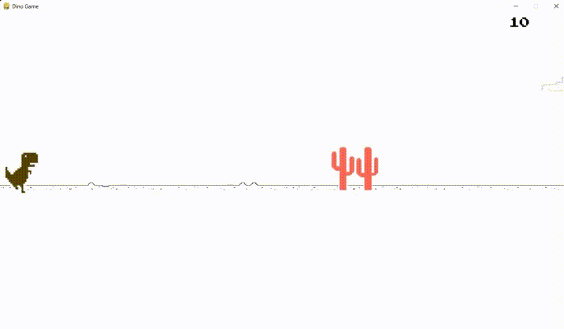

# T-Rex-Game
T-Rex-Game is an endless runner game that was originally created as an Easter egg in the Google Chrome browser. It features a small dinosaur character that runs through a prehistoric landscape, jumping over obstacles and collecting eggs along the way.

If you are a fan of the game and want to try it out in a different programming language, you can check out a Python version of the game. This version has been recreated using Python and Pygame, a set of Python modules designed for writing games. The Python version of Dino Run offers a new way to enjoy the game, while also showcasing the flexibility and versatility of the Python programming language.

Overall, whether you prefer the original Chrome version or the Python version, Dino Run is a fun and addictive game that will keep you entertained for hours.

